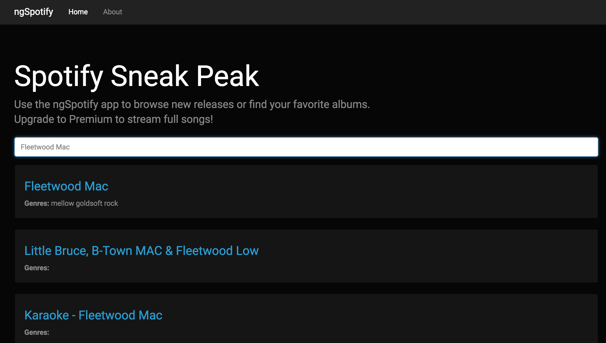
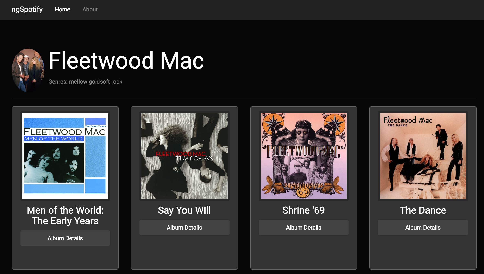
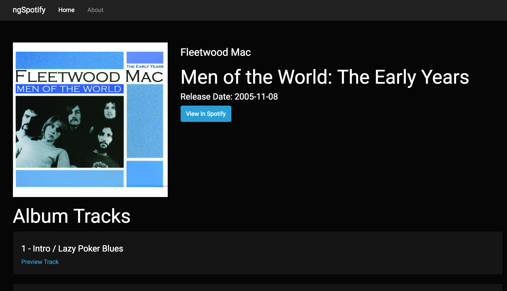

# ngSpotify Web App

This is the fourth exercise in Eduonix's [Learn Angular 2 Development By Building 12 Apps](https://www.udemy.com/learn-angular-2-development-by-building-10-apps/) course.
ngSpotify uses the [Spotify Web API](https://developer.spotify.com/web-api/) to find artists and display albums and track listings.

Eduonix states that they are in the works of supporting RC6 - but we shall see.

# Screenshots

